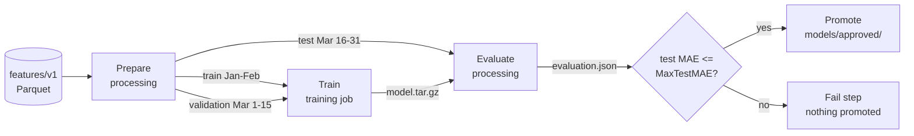

# AWS in 30 Days

A data-science-focused tour of AWS: S3 -> Glue/Athena -> SageMaker -> deployment.
Region: `ca-central-1`. One account, one bucket, one dataset.

## Week 1 - Account, identity, and storage

### Day 1 - Account and guardrails
- Root user locked down with MFA; day-to-day work as an IAM admin user.
- $10/month budget with email alert. Cost Explorer enabled.

### Day 2 - IAM
- Group `data-scientists` with `AmazonS3ReadOnlyAccess` + `AmazonAthenaFullAccess`.
- Hand-written policy [`iam/raw-read-only.json`](iam/raw-read-only.json): list the bucket root,
  read only under `raw/`.
- Tested as `ds-analyst`: `raw/` readable, `models/` denied, upload denied.
- Lesson: to IAM, "not visible" and "denied" are the same thing - the console just
  doesn't show folders it can't list.

### Day 3 - CLI and boto3
- AWS CLI v2, profile `ds` (region `ca-central-1`). `aws sts get-caller-identity` is the first
  thing to run on any Access Denied.
- [`whoami.py`](whoami.py): boto3 session on the same profile, prints account, ARN, buckets.

### Day 4 - S3 layout
Bucket `dave-ds-lab-ca`, versioning on, public access blocked.

| Prefix       | What goes there                                  |
|--------------|--------------------------------------------------|
| `raw/`       | Source files exactly as received. Never edited.  |
| `processed/` | Cleaned, typed Parquet.                          |
| `features/`  | Model-ready tables (versioned: `features/v1/`).  |
| `models/`    | Trained artifacts + `metrics.json`.              |
| `outputs/`   | Predictions, Athena results. Lifecycle: expire after 30 days. |

Dataset: NYC TLC yellow taxi, Jan-Mar 2024, ~50 MB Parquet per month
([`scripts/get_data.py`](scripts/get_data.py)). Uploaded with `aws s3 sync data/ s3://dave-ds-lab-ca/raw/`.

Storage classes, ca-central-1 (per GB-month, approx):
Standard ~$0.025 | Intelligent-Tiering ~$0.025 + monitoring | Glacier Flexible ~$0.004 | Deep Archive ~$0.002.
Deep Archive is ~10x cheaper than Standard but retrieval takes hours and costs extra.

### Day 5 - S3 from pandas
[`notebooks/01_s3_io.ipynb`](notebooks/01_s3_io.ipynb): read Parquet straight from `s3://`,
write a CSV copy, read it back, convert to Snappy Parquet in `processed/`, presigned URL.

| Format  | Size   | Read time |
|---------|--------|-----------|
| CSV     | 314 MB | 348 s     |
| Parquet |  61 MB |  39 s     |

Same 2,964,624 rows x 19 columns. Parquet is 5.2x smaller and 9x faster to read over the network.
CSV also lost the timestamp types (came back as strings) and threw a mixed-dtype warning; Parquet keeps the schema.

### Day 6 - EC2
- Launched a `t3.micro` (Amazon Linux 2023) in `ca-central-1`, SSH open to my IP only.
- No keys copied to the box: an instance role (`ec2-ds-lab-s3-read`, trust policy in
  [`iam/ec2-s3-read-trust.json`](iam/ec2-s3-read-trust.json)) lets the CLI on the instance read the bucket.
- Row count from a Parquet footer on a 1 GB machine without loading the file: 2,964,624 rows (matches Day 5).
- S3 -> EC2 download ran at ~130 MB/s inside the AWS network, vs a few MB/s from home. Data and compute belong in the same region.
- Write test from the instance: `AccessDenied ... assumed-role/ec2-ds-lab-s3-read` - the role, not my user, is the identity.
- Instance table: [`notes/ec2-instances.md`](notes/ec2-instances.md). Terminated the same day.

### Day 7 - Week 1 review
Month-to-date cost: **$0.00** (Cost Explorer, grouped by service - see [`docs/week1-cost-explorer.png`](docs/week1-cost-explorer.png)).
S3 storage and one EC2 hour both fit inside the free allowance.

**What I built this week**

This week was a lot of clicking around AWS, but it finally started to make sense. I set up my account with some guardrails, then dug into IAM-users, roles, and policies and got comfortable reading the JSON structure: Effect, Action, Resource, Condition. The lightbulb moment was seeing how identity policies, resource policies, and roles are different tools for different jobs. I made a data-scientists group with AmazonS3ReadOnlyAccess and AmazonAthenaFullAccess, added a second user to it, and logged in as that user to make sure it actually worked.

On the CLI side, I installed AWS CLI v2, created an access key for my IAM user (not root) installed boto3, opened a session with that profile, listed my buckets, and printed my account ID. For S3, I learned about buckets, prefixes, and storage classes. I created ds-lab-ca, left Block Public Access on, turned on versioning, and set up raw/, processed/, features/, models/, outputs/ the same layout I’ll probably see at work. I uploaded my dataset to raw/ using both aws s3 cp and aws s3 sync.

Then I moved to EC2 and got a better sense of what a cloud machine really is. I launched a free-tier-eligible t3.micro with Amazon Linux, made a key pair, and locked SSH down to just my IP in the security group. I SSH’d in, installed Python, and pulled my S3 data with the CLI but I attached an IAM role to the instance instead of copying keys, which is the proper way. I also checked on-demand vs spot pricing for m5.xlarge and g4dn.xlarge. And before I closed my laptop, I terminated the instance.

**One thing that surprised me**

"not visible = denied" in the S3 console

**What I'd tell someone starting Day 1**

consistency is the key. one step at a time

## Week 2 - SQL over the data lake

### Day 8 - Glue Data Catalog
- Reorganized `raw/` so each table has its own prefix and one file format:
  `raw/yellow/` (3 Parquet months) and `raw/yellow_csv/` (January as CSV). One table = one prefix = one format.
- Database `ds_lab`. Crawler over `processed/` produced table `processed`; it inferred `passenger_count` and
  `ratecodeid` as `double` - correct for that file (the CSV round-trip on Day 5 turned nullable ints into floats),
  but not what the source data means. Crawlers describe files; they don't know intent.
- Hand-written [`ddl/trips.sql`](ddl/trips.sql) -> `ds_lab.yellow_raw` over `raw/yellow/`, types taken from
  the original Parquet schema. Row count: 9,554,778 - and `COUNT(*)` scanned **0 bytes**: Parquet keeps row counts in the file footer, so Athena never read the data.

### Day 9 - Athena
- [`ddl/trips_csv.sql`](ddl/trips_csv.sql): CSV table over `raw/yellow_csv/` for the comparison.
- [`sql/01_explore.sql`](sql/01_explore.sql): five queries with bytes scanned in comments.
- [`sql/01_ctas_clean.sql`](sql/01_ctas_clean.sql): CTAS -> `ds_lab.yellow_clean`, Parquet in `processed/yellow_clean/`.

| Query                | Parquet scanned | CSV scanned |
|----------------------|-----------------|-------------|
| COUNT(*) (January)   | 41.3 MB         | 313.6 MB    |
| avg tip by payment   | 46.4 MB         | 313.6 MB    |
| SELECT * / 2 cols, LIMIT 10 | 30.4 / 10.4 MB | -     |

CTAS `yellow_clean`: 9,210,888 rows kept of 9,554,778 (3.6% dropped by the filters), 160 MB scanned, 11 s, one 209 MB Parquet file.

Athena bills $5/TB scanned. Parquet wins twice: compressed (fewer bytes) and columnar (only the columns you name).

### Day 10 - Partitioning
[`sql/02_partition.sql`](sql/02_partition.sql): CTAS `yellow_part`, partitioned by `year`/`month`, 2 buckets per partition.

| Query: avg tip by payment type, January | Scanned | Time |
|------------------------------------------|---------|------|
| `yellow_clean`, timestamp filter          | 62.4 MB | 1.3 s |
| `yellow_part`, timestamp filter           | 70.1 MB | 1.6 s |
| `yellow_part`, `year = 2024 AND month = 1` | **4.7 MB** | 0.9 s |

Partition pruning only kicks in when the WHERE clause uses the partition columns. Same table, same question,
filtered the "wrong" way, costs the same as no partitioning at all.
Small-files rule: aim for 128 MB - 1 GB per Parquet file. Thousands of 1 MB files make every query slow
regardless of partitioning (each file is an S3 request).

### Day 11 - Feature engineering in SQL
[`sql/03_features.sql`](sql/03_features.sql) -> `ds_lab.trip_features_v1`, Parquet in `features/v1/`,
partitioned by `split`. [`notebooks/02_check_features.py`](notebooks/02_check_features.py) reads it back and checks it.

Three leakage traps this query avoids:
1. **Date-based split, not random.** Train = Jan + Feb, validate = Mar. A random split would let the model
   see trips from the same hour and zone on both sides.
2. **Zone tip-rate computed on training months only.** Target encoding over all data would carry March's
   answers into a March feature.
3. **`total_amount` excluded.** It is fare + tip, so it contains the target. Left in, the model scores
   ~1.0 and is worthless.

Also: credit-card trips only (`payment_type = 1`) - cash tips are never recorded, so their `tip_amount = 0`
is missing data disguised as a real value.

| Split | Rows | Mean tip |
|-------|------|----------|
| train (Jan-Feb) | 4,610,759 | $4.14 |
| valid (Mar)     | 2,570,032 | $4.28 |

7.18M of 9.21M clean trips survive the credit-card + sanity filters. The two means are 3% apart - close enough that the split isn't hiding a regime change.

### Day 12 - Warehouse vs lake (concept day)
[`notes/warehouse-vs-lake.md`](notes/warehouse-vs-lake.md): when I'd pick pandas, Athena, or Redshift;
what Spectrum is for; and what Iceberg fixes about the Hive-style tables I built on Day 10.
No resources created - read, wrote, moved on.

### Day 13 - Lambda
[`lambda/row_counter.py`](lambda/row_counter.py): triggered by `s3:ObjectCreated` under `raw/`,
logs each new Parquet file's size, row count, column count and row-group count to CloudWatch.

- Reads only the **file footer** via `pq.read_metadata`, so a 50 MB upload costs two small range
  requests instead of a 50 MB download. Lambda bills GB-seconds; downloading would be ~10x the cost.
- pyarrow comes from the AWS-managed layer `AWSSDKPandas-Python314`. A bare Lambda has boto3 and the
  standard library and nothing else.
- Execution role: `AWSLambdaBasicExecutionRole` (CloudWatch Logs) + [`iam/lambda-raw-read.json`](iam/lambda-raw-read.json)
  (`s3:GetObject` on `raw/*` only).

Constraints that shape how a DS uses Lambda: 15 min max runtime, 10 GB max memory, 250 MB unzipped
package (layers included), no GPU. Fine for glue, triggers and small scoring; wrong for training.

Log line from the test upload (50 MB file, read with a single 64 KB range request):
```
LANDED  raw/yellow/test-trigger.parquet  50.3 MB  3,007,526 rows  19 cols  3 row groups
```

### Day 14 - Week 2 review
Diagram: [`docs/week2-architecture.md`](docs/week2-architecture.md) - S3 prefixes, Glue catalog, Athena CTAS chain, the Lambda trigger.

Month-to-date cost after two weeks: **$0.00**. Glue crawlers were the only line item worth naming
(~$0.07 each, run twice); everything else rounds to zero. No crawler schedule, so nothing runs on its own.

**What I learned in Week 2**

This week was all about Glue, Athena, and turning S3 into something that actually behaves like a warehouse. The Glue Data Catalog finally clicked for me as a Hive-style metastore: databases → tables → columns, plus the location of the actual files. I created a database called ds_lab, ran a Glue crawler over processed/, and then inspected the schema it guessed. Of course it got a few types wrong, so I fixed them. After that, I rebuilt the same table by hand with a CREATE EXTERNAL TABLE DDL, which made the crawler feel less magical and more like a helpful shortcut.

Then came Athena. I set the query result location to outputs/athena/ and started running SQL straight against S3. I did a SELECT COUNT(*), a GROUP BY, and a date truncation. The real lesson was running the same aggregate on the CSV table and the Parquet table and writing down the bytes scanned for each. Same answer, very different scan sizes. I also learned CREATE TABLE AS SELECT with format = 'PARQUET'  that’s how you materialize a cleaned table instead of just querying raw files forever.

Partitioning was next. I rewrote the table partitioned by year/month using partitioned_by = ARRAY['year','month'] in CTAS and looked at how the S3 key structure changed. Querying one month with and without the partition filter showed exactly why partitioning matters: the bytes scanned dropped by roughly the partition fraction. I also got the small-files problem drilled into me, you want 128 MB–1 GB Parquet files, not thousands of tiny ones.

Feature engineering in SQL was probably the most practical part. I built a features table with CTEs: rolling averages using window functions, lag features, time-of-day and day-of-week, and target encoding of a category by group. I CTAS’d it to features/v1/ as Parquet. I made the train/validation split based on date, not random, because leakage matters. Then I read the result back with pandas from S3 and sanity-checked nulls and ranges.

Concept day was warehouse vs lake. I read about Redshift, provisioned vs Serverless, Redshift Spectrum, and when a team would pick a warehouse over Athena: concurrency, BI dashboards, joins across many tables, predictable latency. I also read the lakehouse pitch, Iceberg tables in S3, queryable by both Athena and Redshift. I’ve been told I’ll hear “Iceberg” in interviews this year, so I paid attention.

Finally, Lambda. I wrote a Python Lambda that triggers on s3:ObjectCreated under raw/, reads the new file’s size and row count, and logs it to CloudWatch. I uploaded a file and found the log line in CloudWatch Logs. The constraints that shape how data science teams use Lambda stuck with me: 15-minute limit, memory up to 10 GB, and no pandas by default.

## Week 3 - SageMaker

### Day 15 - SageMaker setup and the execution role
- Classic notebook instance `ds-lab-notebook`, `ml.t3.medium` (2 vCPU, 4 GB), chosen over Studio because it is
  one resource with one Stop button.
- Execution role created by SageMaker, plus inline policy [`iam/sagemaker-bucket-access.json`](iam/sagemaker-bucket-access.json):
  read `features/` and `processed/`, read/write `models/` and `outputs/`, nothing on `raw/`.
- [`notebooks/03_sagemaker_features.ipynb`](notebooks/03_sagemaker_features.ipynb): counted rows from footers,
  loaded only `split=valid` (partition filter pushed down), proved the role can't write `raw/`.
- Loaded only the valid split: 2,570,032 rows, the train folder never downloaded.
- Stopped the instance at the end of the session.

### Day 16 - Train in the notebook, save to S3
[`notebooks/04_train_manual.ipynb`](notebooks/04_train_manual.ipynb): 1.5M sampled training rows (Jan-Feb),
500k validation rows (Mar), scikit-learn `HistGradientBoostingRegressor`, target `tip_amount`, credit-card trips only.

| Model (validation, March) | MAE | RMSE | R² |
|---------------------------|-----|------|----|
| Predict the training mean | $2.45 | $3.96 | 0.00 |
| Zone tip rate x fare (one-line rule) | $1.33 | $2.63 | 0.56 |
| HistGradientBoosting      | **$1.24** | **$2.34** | **0.65** |

Artifact: `s3://dave-ds-lab-ca/models/manual/model.tar.gz` (joblib at the root, SageMaker's convention)
plus `metrics.json` next to it with data, params, metrics and top features.

The honest read: the one-line rule gets most of the way. Tipping is mostly a percentage of the fare,
and the model's gain over the rule is real but modest. Top feature by permutation importance: `fare_amount` (10x the next one), then `zone_tip_rate`, `trip_distance`,
`fare_per_minute`, `tolls_amount`. 100 boosting rounds, 21 s on `ml.t3.medium`. Trained with scikit-learn **1.7.2** -
whatever loads this artifact later must use the same version.

### Day 17 - Managed training job, built-in XGBoost
- [`sql/04_xgb_channels.sql`](sql/04_xgb_channels.sql): Athena `UNLOAD` writes the full train (Jan-Feb) and
  validation (Mar) splits as headerless CSV, target first - the built-in algorithm's input contract.
- [`notebooks/05_train_builtin.ipynb`](notebooks/05_train_builtin.ipynb): one `CreateTrainingJob` call via boto3.
  SageMaker ran it on its own `ml.m5.large`, wrote `models/builtin/<job>/output/model.tar.gz`, shut down.

| | Day 16 (notebook) | Day 17 (training job) |
|---|---|---|
| Where it ran | inside the notebook | separate `ml.m5.large`, gone afterwards |
| Training rows | 1.5M sample | 4.6M (all) |
| Validation MAE | $1.24 | **$1.24** (1.2365) |
| Billable seconds | n/a | 285 |
| Cost | notebook hour | ~$0.01 |

Caveat: the job used March for early stopping, so March is slightly less "unseen" than on Day 16.

Job `xgb-tips-20261005-235240`, image `sagemaker-xgboost:1.7-1`. Learning curve from the job log
(validation MAE): round 0 $3.49 -> round 10 $1.90 -> round 50 $1.25 -> round 100 $1.237 -> stopped at round 155, $1.2365.
Almost all the gain is in the first 50 trees; the last 100 bought a tenth of a cent.
Train MAE $1.18 vs validation $1.24 - a small gap, so it isn't badly overfitting.

Three different routes - sklearn in a notebook, sklearn as a script-mode job, built-in XGBoost as a job - all land on
**$1.24**. That's the data's ceiling with these features, not the algorithm's. Better features would move it; more tuning won't.

### Day 18 - Script mode: bring your own code
- [`src/train.py`](src/train.py): the Day 16 model as a script. Reads `SM_CHANNEL_TRAIN` / `SM_CHANNEL_VALIDATION`,
  writes to `SM_MODEL_DIR`, takes hyperparameters as `--flags`. Same file runs on the laptop (reading `s3://` directly)
  and inside SageMaker's scikit-learn container - no code changes.
- [`scripts/launch_train.py`](scripts/launch_train.py): uploads `sourcedir.tar.gz`, calls `CreateTrainingJob` with the
  scikit-learn 1.2-1 image. Launched from the laptop - no notebook instance running.
- `train.py` prints `validation:mae=1.23;` lines; the job's `MetricDefinitions` regexes scrape them into the console.

| Run | Where | Train rows | Validation MAE | Billable s |
|-----|-------|-----------:|---------------:|-----------:|
| Laptop smoke test | local, from S3 | 200k (first rows, not random) | $1.49 | 0 |
| SageMaker job `sk-tips-20261005-171530` | `ml.m5.large` | 4.6M | **$1.24** | 219 (~$0.01) |

### Day 19 - Track experiments
Three more script-mode jobs, launched in parallel from the laptop, each changing one idea:

| Tag | Change vs Day 18 | Question it asks |
|-----|------------------|------------------|
| `shallow` | `--max-leaf-nodes 15` | Does a simpler tree lose much? |
| `deep` | `--max-leaf-nodes 255 --min-samples-leaf 50` | Does more capacity find anything? |
| `slow` | `--learning-rate 0.03 --max-iter 1000` | Does patient boosting beat fast boosting? |

[`scripts/compare_runs.py`](scripts/compare_runs.py) pulls every `sk-tips-*` job's hyperparameters, scraped metrics and
billable seconds from SageMaker into one DataFrame -> [`notes/experiments.md`](notes/experiments.md). SageMaker already
records all of this per job; the script only lines it up. `--mlflow` also logs the runs to a local MLflow store.

Winner: `sk-tips-deep-20261005-183143` (255 leaves, min 50 per leaf), MAE **$1.2361**. Promoted to `s3://dave-ds-lab-ca/models/candidate/model.tar.gz` with `candidate.json` beside it.

Result in one line: five runs, four very different tree shapes, and the whole spread is **$0.0067** -
from $1.2361 (deep) to $1.2428 (shallow). Tuning moves the third decimal. The features set the ceiling (see Day 17).

| Run | Leaves | Learning rate | Validation MAE | Billable s |
|-----|-------:|--------------:|---------------:|-----------:|
| deep | 255 | 0.1 | **$1.2361** | 204 |
| slow (x2) | 63 | 0.03 | $1.2376 | 405 / 399 |
| Day 18 default | 63 | 0.1 | $1.2378 | 219 |
| shallow | 15 | 0.1 | $1.2428 | 239 |

The `slow` run was launched twice by accident. Both copies returned an identical MAE to four decimals -
fixed seed, same data, same code: training is reproducible. All five runs together cost about $0.05.

### Day 20 - Batch Transform
[`src/inference.py`](src/inference.py): the four serving hooks (`model_fn`, `input_fn`, `predict_fn`, `output_fn`) the
scikit-learn container calls. [`scripts/batch_score.py`](scripts/batch_score.py): `CreateModel` from
`models/candidate/model.tar.gz`, then `CreateTransformJob` over all of March.

`DataProcessing` does the join for free: `InputFilter "$[1:]"` hides the true tip from the model,
`JoinSource "Input"` glues the prediction back onto the row, `OutputFilter "$[0,-1]"` keeps
`actual,predicted`. [`sql/05_score_predictions.sql`](sql/05_score_predictions.sql) scores it in Athena.

| | Value |
|---|---|
| Rows scored | 2,570,032 (all of March) |
| Transform run time / cost | 2.5 min of scoring (6 min including machine start-up), ~$0.01 |
| MAE computed in SQL | **$1.2355** (training job said $1.2361 - the 0.06c gain is the clip at $0) |

Where the error comes from (`sql/05_score_predictions.sql`, query 2):

| Actual tip | Trips | Avg actual | Avg predicted | MAE |
|------------|------:|-----------:|--------------:|----:|
| $0         | 132,694 | $0.00  | $3.66  | $3.66 |
| under $2   | 300,955 | $1.29  | $2.71  | $1.43 |
| $2-5       | 1,520,766 | $3.17 | $3.09 | **$0.62** |
| $5-10      | 390,309 | $6.38  | $5.78  | $1.58 |
| $10+       | 225,308 | $14.62 | $12.14 | $3.12 |

The model is good where most trips are ($2-5, 59% of trips, 62c error) and pulls everything toward the middle:
it over-predicts small tips and under-predicts big ones. The two tails - $0 and $10+, 14% of trips - make up 37% of all
error. Nothing in the features says *who* skips the tip or *who* tips big; that's the ceiling Days 17-19 kept hitting.

Why batch beats an endpoint here: predictions are needed once a day for a known set of trips. A transform job runs
for minutes and stops; an endpoint bills every hour it's up, whether anyone calls it or not.

### Day 21 - Week 3 - Review

**What ran this week, from the job records** (`ml.m5.large`, ~$0.134/h list price in ca-central-1):

| Job | Type | Billable s | Approx cost |
|-----|------|-----------:|------------:|
| `sk-tips-20261005-171530` (Day 18 default) | training | 219 | $0.008 |
| `xgb-tips-20261005-235240` (Day 17 built-in XGBoost) | training | 285 | $0.011 |
| `sk-tips-deep-…` (Day 19 winner) | training | 204 | $0.008 |
| `sk-tips-slow-…` x2 (one accidental) | training | 804 | $0.030 |
| `sk-tips-shallow-…` | training | 239 | $0.009 |
| `tips-batch-20261005-215425` (Day 20) | transform | ~149 | $0.006 |
| **All SageMaker jobs** | | **~1,900** | **~$0.07** |

The notebook instance (`ml.t3.medium`, ~$0.05/h) ran a few hours across Days 15-17 - more than all the jobs combined.
Cost Explorer showed **$0.00** for the month at review time: the new-account free allowance covered it.
`outputs/athena/` had grown to 1.5 GB of saved query results; the Day 4 lifecycle rule expires them after 30 days.

**Teardown.** Deleted the notebook instance - from Day 18 on every job launched from the laptop, so it was only an idle
bill waiting to happen. Kept: the execution role (jobs need it), the `tips-candidate` model record (free; Day 22 deploys
it), the Lambda (free when idle), all S3 data. Confirmed nothing running in ca-central-1 or us-east-1.

**What I learned in Week 3**

This week I finally got the difference between a SageMaker notebook and a training job. A notebook is where I poke around, try things, break stuff, and figure out the code. A training job is where I hand that code to AWS and let it run on its own machine, which shuts down when it's done. They're not rivals; they're two phases of the same lifecycle. The notebook was also my biggest SageMaker cost of the week, because it bills while it sits there. So once everything launched from my laptop, I deleted it.

The quota wall was real. My new account started with a limit of 0 ml.m5.large instances for training, so my first job failed with ResourceLimitExceeded. The increase request became a support case and took about a week; AWS came back with 15 for training and 8 each for batch transform and endpoints. Lesson: request quotas before the day you need them.

Script mode is the "one file, two places" idea. I wrote one train.py. On my laptop I run it as a quick test on 200k rows. launch_train.py uploads that same file, and SageMaker runs it inside its scikit-learn container on all 4.6M rows. The script never changes; it just reads its input and output folders from environment variables. That gives you a clean environment every run and the same code from test to production.

I logged all five training runs to a local MLflow store and compared them in its UI. MLflow tracks the parameters, metrics and artifacts of every run, so results are comparable and reproducible, and its registry versions the model that gets promoted. I accidentally ran one experiment twice, and both copies gave exactly the same MAE, so the training is reproducible.

The result that stuck with me: everything landed on a validation MAE of about $1.24. scikit-learn on a sample, scikit-learn on all the data, and XGBoost on all the data: same number. Then shallow, slow and deep trees: a spread of under one cent. When different algorithms, more data and tuning all hit the same wall, the wall is the features, not the model. Deep won, and it was also the cheapest run. Batch-scoring all of March showed where the error lives: the model is off by 62¢ on typical $2–5 tips, but $0 and $10+ tips, 14% of trips, make up 37% of the error. Nothing in my features says who skips the tip or who tips big.

I used batch scoring instead of an endpoint because nobody needed a prediction in real time. I needed 2.57M trips scored once. The batch job ran for 2.5 minutes and stopped. An endpoint would have billed every hour it was up, whether anyone called it or not.

## Week 4 - Deployment and the plumbing around it

### Day 22 - Real-time endpoint
[`scripts/endpoint_demo.py`](scripts/endpoint_demo.py): `EndpointConfig` + `Endpoint` from the Day 20 model record,
same `inference.py`, called with `boto3` `sagemaker-runtime`. Deletes everything in a `finally` block.

| | Real-time (`ml.t2.medium`) | Serverless (2 GB) |
|---|---|---|
| Existed for (create -> delete, CloudTrail) | 7.9 min | 5.0 min |
| Requests served | 26 | 26 |
| Model latency, typical (CloudWatch `ModelLatency` avg) | 16 ms | 33 ms |
| Model latency, worst | 68 ms | **717 ms** (first call - cold start) |
| SageMaker overhead per call, avg | 51 ms | 31 ms |
| Price model | $0.061/hour while it exists (AWS Pricing API, ca-central-1) | per ms of compute + per request |
| Idle for a month (x730 h) | **~$44.53** | $0 |

Latencies are server-side, from CloudWatch; the round trip from Edmonton adds network time on top.
The serverless cold start is the trade: the first request after idle waits ~0.7 s while AWS loads the container,
in exchange for paying nothing when nobody calls.

Same model, same container, same `inference.py` as Day 20's batch job - only how it's called changed.
Batch is the default for a reason: an always-on endpoint costs the same at 3 a.m. with zero traffic as at noon.

### Day 23 - Docker and ECR
- [`Dockerfile`](Dockerfile): `python:3.12-slim`, pinned [`requirements-train.txt`](requirements-train.txt),
  a `train` executable on PATH - because SageMaker starts every training container with `docker run <image> train`.
- First SageMaker run on my image trained fine (MAE $1.2391) and then crashed saving the model:
  `PermissionError: /opt/ml/model/model.joblib`. I'd made the image non-root; SageMaker mounts its own root-owned
  `/opt/ml/model` over the image's. Training containers run as root (AWS's do too); non-root is for containers
  that serve traffic. Worked locally because my `docker run` controlled the mount - a local test isn't the platform.
- [`src/train.py`](src/train.py) now runs in three places with no code changes: laptop (flags), AWS's scikit-learn
  container (toolkit sets `SM_*` and passes flags), and my own image (no toolkit - it falls back to the raw
  `/opt/ml/input/data`, `/opt/ml/model`, `hyperparameters.json` contract).
- [`scripts/build_push.py`](scripts/build_push.py) is the Makefile: `sample`, `build`, `run`, `push`.
  `run` mounts data exactly where SageMaker would and sends the same `train` command.
- ECR repo `ds-lab-train`, scan on push, lifecycle policy keeps the last 3 images.

| | Value |
|---|---|
| Image size (local / compressed in ECR) | 633 MB / 145 MB |
| Local container run on 20k rows | worked - MAE $1.40, 0.2s, scikit-learn 1.9.1 |
| SageMaker job on my image (`sk-tips-byo-20261006-111544`) | **Completed**, all 4.6M rows, MAE **$1.2391**, 138 billable s (~$0.005) |

### Day 24 - Serverless inference with Lambda
- [`lambda_model/`](lambda_model/): AWS's Lambda Python base image + pinned scikit-learn 1.9.1 + the Day 23 model
  baked in. [`app.py`](lambda_model/app.py) loads the model **once per container** (module level), so only cold
  starts pay for it; `handler` just predicts. JSON in, JSON out, 400 with the expected fields on bad input.
- [`scripts/deploy_lambda_model.py`](scripts/deploy_lambda_model.py): `build`, `local` (Lambda's runtime emulator on
  localhost), `deploy` (ECR + function + public Function URL, concurrency capped at 2), `test`, `url-off`, `delete`.
- Same model, third way to serve it: batch job (Day 20), SageMaker endpoint (Day 22), Lambda (today).

```
curl.exe -s -X POST "<function-url>" -H "Content-Type: application/json" --data-binary "@lambda_model/sample_request.json"
-> {"predicted_tip": [3.45, 13.45, 2.82], "n": 3, "ignored_keys": [], "model": {"sklearn": "1.9.1", "valid_mae": 1.2391, ...}}
```

| | Value |
|---|---|
| Cold start, first after deploy | **~11.7 s**: init hit Lambda's 10 s limit (`Status: timeout`), then re-ran inside the first request (1.7 s) |
| Warm round trip from Edmonton | ~220 ms (spacing of sequential calls) |
| Warm handler time (CloudWatch `Duration`) | **~3.6 ms** |
| Idle cost | $0 |

The cold start is the story. The first container after a deploy spent 10 s initializing and was cut off at
Lambda's 10-second init limit - pulling a 300 MB image from ECR for the first time, then importing scikit-learn.
Lambda retried the init inside the request, which then took 1.7 s now that the image was cached. Once warm, the
model answers in under 4 ms; almost all of the ~220 ms a caller waits is network. So the same function is either
the fastest thing this month or an 11-second wait, depending only on whether a container is warm.

Why big models don't belong here: the cold start is mostly *importing scikit-learn and loading the model*. A 2 GB
model or a PyTorch import turns that into tens of seconds, and Lambda has no GPU. Small tabular model, spiky or tiny
traffic: Lambda. Steady traffic or big model: an endpoint. Nobody waiting: batch.

### Day 25 - SageMaker Pipelines
[`pipeline/pipeline.py`](pipeline/pipeline.py) chains the month into one DAG that SageMaker runs and records:



- Every step runs in the Day 23 image (`ds-lab-train`, now with pyarrow): one set of library versions end to end.
- [`prep.py`](pipeline/prep.py) finally fixes the Days 17-19 caveat: March is split into **validation** (1-15, early
  stopping) and **test** (16-31, read once by [`evaluate.py`](pipeline/evaluate.py)). The reported number comes from
  trips nothing was tuned on.
- The Condition reads `regression.mae` out of `evaluation.json` (`JsonGet` on a `PropertyFile`); `MaxTestMAE` is a
  pipeline parameter, so the bar can change per run without editing code.
- [`pipeline/definition.json`](pipeline/definition.json): the JSON the SDK generates - the pipeline itself is just this
  document; SageMaker executes it.

| Run | MaxTestMAE | Result | Test MAE | Wall clock |
|-----|-----------:|--------|---------:|-----------:|
| 1 `jzpma812db1f` | 1.30 | **Succeeded** - promoted to `models/approved/` | $1.2567 | 22.6 min |
| 2 `euljh9tiuzuy` | 1.20 | **Failed** at `MAETooHigh`: *"Test MAE 1.2567 is above the bar of 1.2"* | $1.2567 | 17.8 min |

The honest number: on the untouched test slice (Mar 16-31, 1,283,362 trips) the model scores **$1.2567**, about 2 cents
worse than the $1.236 it showed on the March data that picked it in Days 17-19. That gap is the optimism the caveat
warned about - small here, but now measured instead of guessed. The one-line rule scores $1.3494 on the same trips,
so the model still beats it by ~9 cents. Both runs produced the identical MAE: the whole pipeline is reproducible.
Step time is mostly machine start-up - each step took ~5-7 min wall clock for well under a minute of real work.

Alternatives you'll meet at work: Step Functions (AWS-native state machines, any service), Airflow / MWAA
(the data-engineering default, cron + Python DAGs), plain cron on a box. SageMaker Pipelines' edge is that every step
is already a SageMaker job, with lineage between them recorded for free.

### Day 26 - Secrets, logs and alarms
[`scripts/ops_demo.py`](scripts/ops_demo.py) - `secrets`, `logs`, `alarm`, `break`, `audit`, `teardown`.

**Secrets and config.** A fake database login lives in Secrets Manager (`ds-lab/fake-db`, KMS-encrypted, audited,
$0.40/month); plain config in Parameter Store (`/ds-lab/bucket`, `/ds-lab/max-test-mae`, free). Application code asks
AWS at runtime - nothing in the repo, nothing in an `.env` file:

```python
secret = json.loads(boto3.client("secretsmanager").get_secret_value(SecretId="ds-lab/fake-db")["SecretString"])
bucket = boto3.client("ssm").get_parameter(Name="/ds-lab/bucket")["Parameter"]["Value"]
```

Scanned the whole git history for access keys (`AKIA...`, `aws_secret_access_key`): none. The only "password"
variables in the repo are short-lived ECR login tokens fetched at runtime.

**Logs.** Every log group defaulted to *never expire*; set all of them to 30 days.

**Alarm.** Metric filter on the row-counter Lambda's log turns each `[ERROR]` line into a `DsLab/RowCounterErrors`
data point; an alarm emails me via SNS when it's >= 1 in a minute. Tested end to end by uploading a text file named
`.parquet` to `raw/`:

| | Value |
|---|---|
| Alarm ARN | `arn:aws:cloudwatch:ca-central-1:754928766714:alarm:ds-lab-row-counter-errors` |
| First Lambda error -> alarm state ALARM | ~1 min (error 12:00:18, ALARM 12:01:20) |
| Errors counted | 3 - the first failure plus S3's two automatic retries (12:00, 12:01, 12:03) |

The Lambda's own log line: `[ERROR] ArrowInvalid: Parquet magic bytes not found in footer` - the same footer read
that works on real files, failing loudly on a fake one. Secret then scheduled for deletion (7-day recovery window).

**CloudTrail.** Every API call is already recorded for 90 days at no cost. `audit` shows who deleted the notebook,
both endpoints and the Function URL, and that the pipeline's training jobs were created by the pipeline's own role.

### Day 27 - Networking, just enough (concept day)
No resources created. [`notes/networking.md`](notes/networking.md) maps my account's default VPC as it actually is
(read with the CLI: one `/16`, three public `/20` subnets in 1a/1b/1d, one route table sending `0.0.0.0/0` to an
internet gateway, no NAT, no endpoints) and defines the pieces: subnets, route tables, IGW, NAT gateway, gateway vs
interface endpoints, security groups (stateful) vs NACLs (stateless).

**"My SageMaker notebook is in a private subnet and `pip install` hangs. Why, and what are the two fixes?"**

pip install hangs because the notebook sits in a private subnet: its route table has no 0.0.0.0/0 route to an internet gateway, so requests to PyPI have nowhere to go. Nothing refuses them, so pip just waits until it times out. There are two standard fixes, depending on the organisation’s security policy:

NAT gateway (~$0.05/hour plus a charge per GB): put a NAT gateway in a public subnet and point the private subnet’s 0.0.0.0/0 route at it. The notebook can download from the internet, and nothing from the internet can connect in.

No internet at all (~$0.01/hour per Availability Zone per endpoint): a CodeArtifact repository that mirrors PyPI, reached through interface VPC endpoints plus a free S3 gateway endpoint. pip installs from inside AWS’s network and the notebook never touches the internet.

A bank or hospital would usually choose the second option. A third option is to bake the dependencies into a custom container image (as I did on Day 23), so nothing has to be installed at runtime.


### Day 28 - Cost, tagging and teardown
[`scripts/teardown.py`](scripts/teardown.py) - `tag`, `plan`, `apply`, `report`, two levels:

| Level | Deletes | Why |
|-------|---------|-----|
| default | SageMaker endpoints/notebooks/running jobs (none left), both ECR repos (~1 GB of images), the Lambda model API + role, any Function URL, the Day 6 SSH security group + key pair, 20 old S3 object versions (0.57 GB), the Day 26 secret | bills while idle, or a security leftover |
| `--all` | + row-counter Lambda and its S3 trigger, alarm, SNS, parameters, SageMaker model + pipeline, Glue crawler + catalog, remaining lab roles, `outputs/` | free, but finished |

Never touched: the bucket's current data, IAM users, the budget, the SageMaker execution role, the code.
`plan` is always a dry run first - a teardown script that can't show its work isn't one I'd run.

Tagging: everything I created from Day 13 on was tagged `project=ds-lab` at creation; the console-made pieces from
Weeks 1-2 (bucket, row-counter Lambda, Glue, roles, log groups) were tagged retroactively, and `project` was activated
as a cost-allocation tag so Cost Explorer can filter by it.

| | Value |
|---|---|
| Teardown level run | default (`apply`) - a re-run of `plan` now finds 0 items. Kept: row-counter Lambda, Athena tables, alarm (all free) |
| Cost, September (Cost Explorer) | **$0.00** |
| Cost, October to date | **$0.00** - the new-account free allowance covered every job, endpoint and notebook hour |
| What the same setup would cost running 24/7 | **~$87/month** - see below |

**The $87 vs $2 lesson** (AWS Pricing API, ca-central-1, list prices):

| If it ran in production like this... | $/month |
|---|---:|
| Notebook `ml.t3.medium` left on 24/7 ($0.056/h) | $40.88 |
| Real-time endpoint `ml.t2.medium` 24/7 ($0.061/h) | $44.53 |
| Pipeline once a day (~25 min of machines) | ~$1.20 |
| S3, Athena, ECR, Lambda, alarm | ~$0.50 |
| **Total** | **~$87** |
| **Same results, built the way this repo ended up** - notebook deleted, batch scoring instead of an endpoint, jobs that stop themselves | **~$2** |

Same model, same predictions. The 40x difference is entirely in two decisions: never leave a notebook running, and
don't stand up an endpoint for predictions nobody needs in real time.
