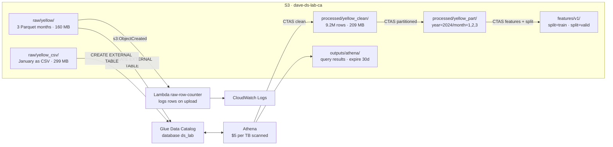

# Week 2 data flow

## What each hop costs

| Step | Scanned / billed | Note |
|------|------------------|------|
| `COUNT(*)` on Parquet | 0 bytes | row count lives in the footer |
| `COUNT(*)` on CSV | 313.6 MB | every byte read |
| avg tip by payment, unpartitioned | 62.4 MB | baseline |
| same, partitioned but filtered on the timestamp | 70.1 MB | **no pruning** - the trap |
| same, filtered on `year`/`month` | 4.7 MB | 13x cheaper |
| Lambda per upload | 64 KB fetched, ~700 ms | footer only, free tier |

Whole week: under $0.20, most of it the two Glue crawler runs.
