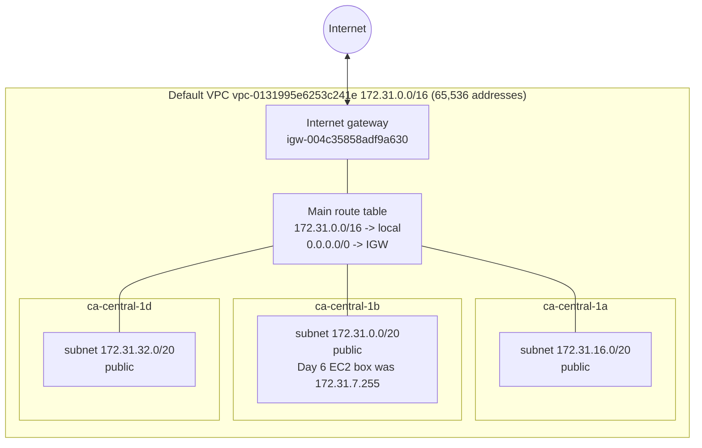

# Networking, just enough (Day 27)

No resources created today. NAT gateways bill by the hour, so this is read, map, explain.

## My account's default VPC, as it actually is (ca-central-1, read with the CLI)

| Piece | What I have | What it means |
|---|---|---|
| VPC | `172.31.0.0/16`, the default one AWS creates | My own private network. Every EC2 box, notebook, endpoint ENI lives in one. |
| Subnets | 3, one per Availability Zone, `/20` each (4,091 usable IPs) | A slice of the VPC pinned to one data centre. |
| Route table | one: `local` + `0.0.0.0/0 -> internet gateway` | **This route is what makes all three subnets "public".** |
| Internet gateway | attached | The door to the internet - only for things that also have a public IP. |
| NAT gateway | none | Would let private things *call out* without being reachable. Costs per hour. |
| VPC endpoints | none | Private side-doors to AWS services (S3, SageMaker, ECR...) that never touch the internet. |
| Network ACL | the default one (allow all) | Subnet-level firewall. |
| Security groups | `default`, and `ds-lab-ssh` (Day 6, SSH from my old IP /32, attached to nothing) | Instance-level firewall. Leftover - delete on Day 28. |

Everything I ran on SageMaker this month used AWS-managed networking (no VPC configured), which is why `pip install`
in the notebook simply worked. Companies usually turn that off.

## The words, in one line each

- **VPC** - your private network in a region. Nothing gets in or out unless a route and a firewall rule both allow it.
- **Subnet** - part of the VPC in one Availability Zone. "Public" or "private" is not a setting; it's decided by
  the subnet's route table.
- **Public subnet** - its route table sends `0.0.0.0/0` to an **internet gateway**.
- **Private subnet** - no route to an internet gateway. Things inside can talk to the VPC, not to the internet.
- **Internet gateway (IGW)** - two-way door to the internet, for resources with a public IP.
- **NAT gateway** - sits in a *public* subnet; private subnets route `0.0.0.0/0` to it. Outbound-only: private
  machines can download things, nobody can connect in. About $0.05/hour plus a charge per GB, always on.
- **VPC endpoint** - private connection from the VPC to an AWS service.
  *Gateway* endpoints (S3, DynamoDB) are a route-table entry and free.
  *Interface* endpoints (SageMaker API, ECR, CloudWatch Logs, CodeArtifact, ...) are a network card in your subnet,
  roughly $0.01/hour per AZ each.
- **Security group** - firewall on the instance's network card. **Stateful**: allow a request out and the reply
  is let back in automatically. Allow rules only. My `ds-lab-ssh` group is one.
- **Network ACL** - firewall on the whole subnet. **Stateless**: replies need their own rule. Allow *and* deny
  rules, evaluated in number order. Usually left at the default.

## How a packet gets out (the checklist when something "hangs")

A connection from a machine to `pypi.org` needs **all** of these:

1. The security group allows that **outbound** traffic (default: all outbound allowed).
2. The subnet's NACL allows it out **and** allows the reply back in (default: all allowed).
3. The subnet's route table has a route for `0.0.0.0/0` - to an internet gateway (and the machine has a public IP)
   or to a NAT gateway.
4. DNS can resolve the name (VPC DNS on by default).

"Hangs" rather than "error" is the tell for a missing route or a dropped packet: nothing replies, so the client
waits for its timeout. A refused connection or a 403 means the packet *did* arrive somewhere.

## The interview scenario

> *"My SageMaker notebook is in a private subnet and `pip install` hangs. Why, and what are the two fixes?"*

Use the checklist above. Which step fails in a private subnet? What are the two different ways to give a machine
a path to the packages it needs - one that opens a path to the internet, and one that never touches the internet?
What does each cost, and which would a bank or a hospital pick?

My answer is in the README, Day 27.
